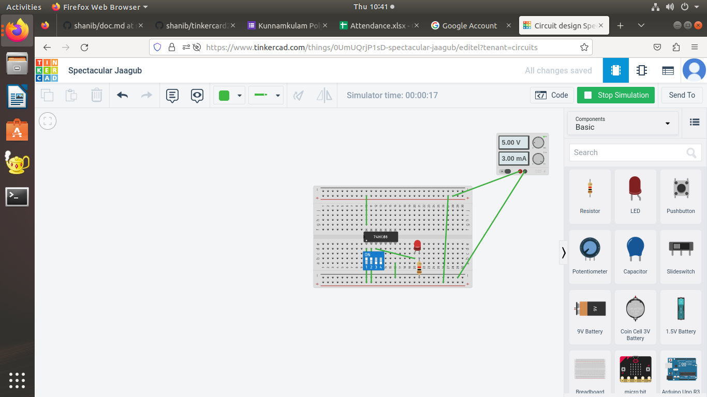
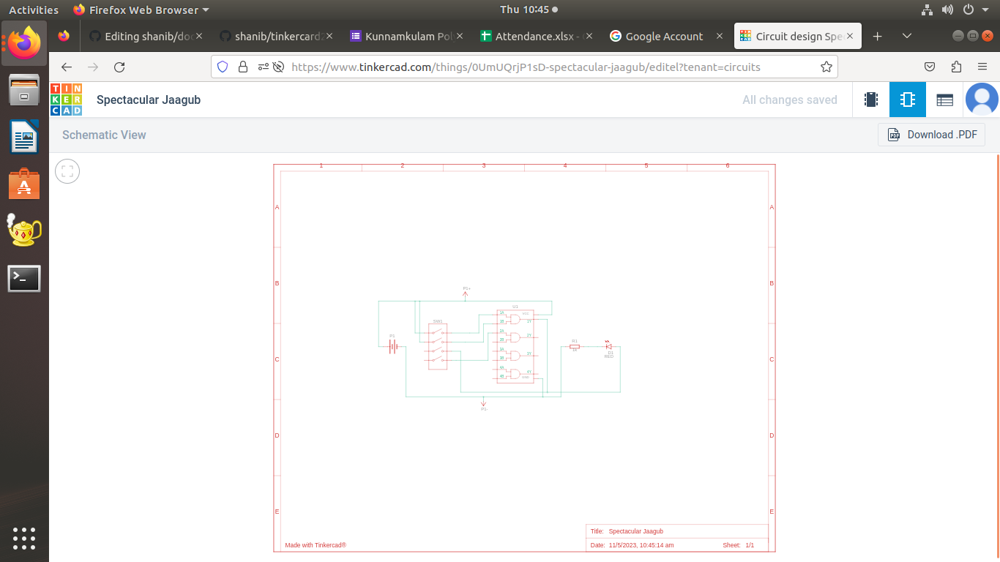
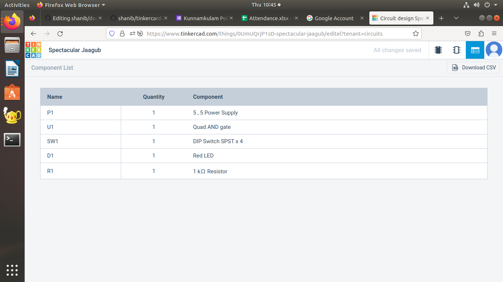
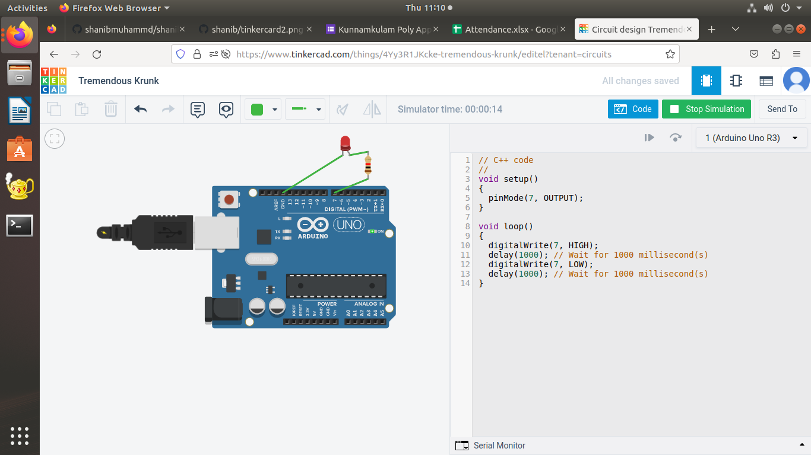
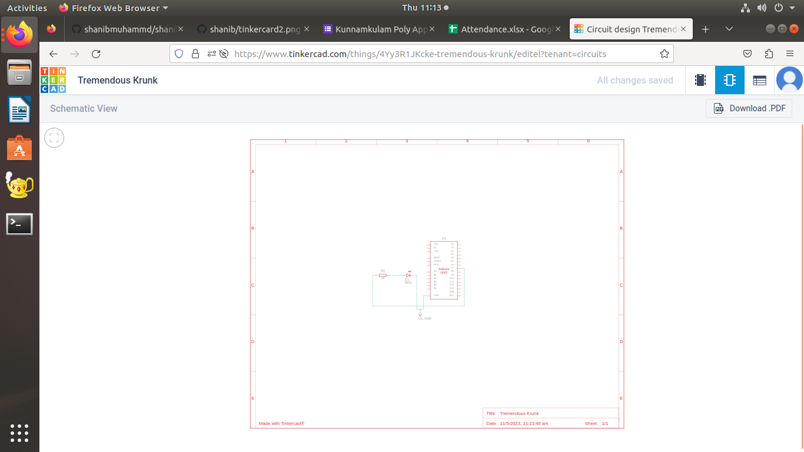
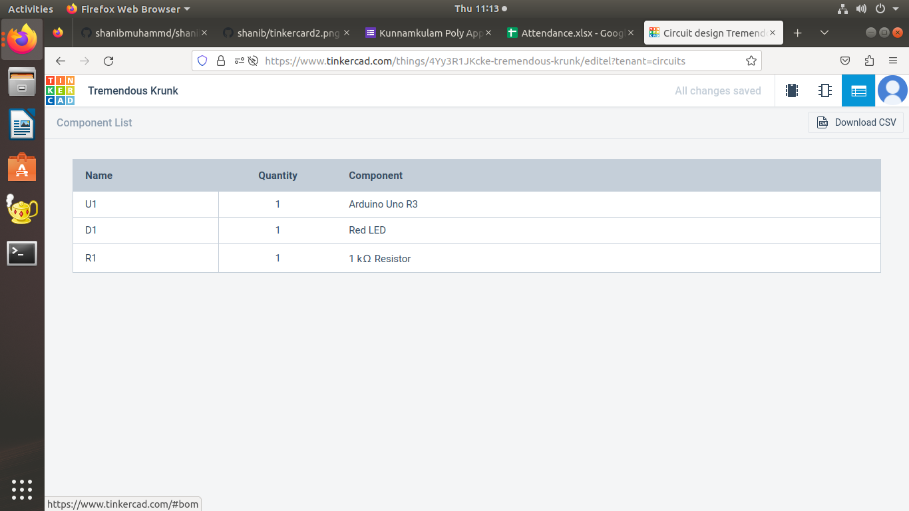
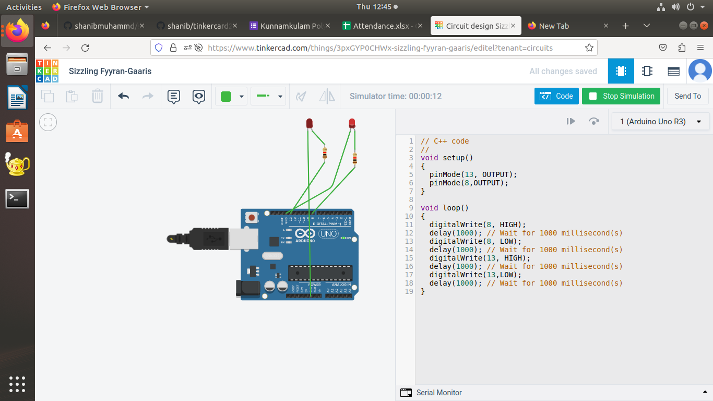

# 10 days internship at jyothi engineering college
# day-2 tinkercard program 1
## [click here](https://www.tinkercad.com/things/bD37qElXLOw-smashing-jaban)

# day-2 tinkercard program 2
## [click here](https://www.tinkercad.com/things/7pk1nxnL2VO-swanky-curcan-duup)

# day-3 tinkercard program 3
## using and gate progarm 
## [click here](https://www.tinkercad.com/things/0UmUQrjP1sD-spectacular-jaagub/editel)

## schimattic diagram

## components required

## blinking led using adrino

## schimattic diagram

## components required

## 2 BLINKING LED USING ARDUINO
## [CLICK HERE](

## SCHIMATIC DIAGRAM
[EXP 4-1](img/2 LED BLINKING-1.png)
## COMPONENTS REQUIRED
[EXP 4-2](img/2 LED BLINKING-2.png)
